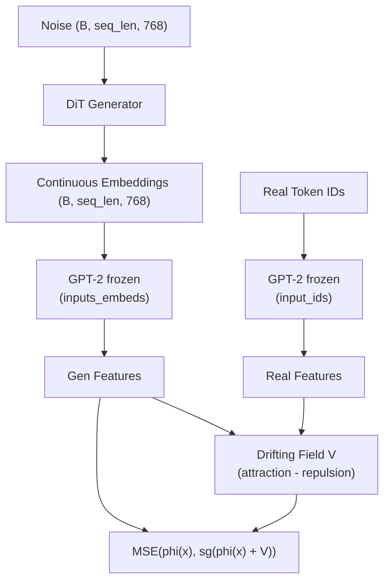

# Drifting Models for Text Generation

An adaptation of [Generative Modeling via Drifting](https://arxiv.org/abs/2602.04770) (Deng et al., 2026) to text generation. The generator outputs continuous embeddings decoded to tokens via nearest-neighbor lookup against GPT-2's vocabulary.

The key idea of drifting models are that iteration happens at **training time** (via SGD) rather than inference time using push forward distributions, enabling 1-step generation.

## Architecture



At inference: `noise -> generator -> nearest-neighbor to GPT-2 vocab embeddings -> tokens`.

## Setup

Requires Python 3.11+.

```bash
uv venv && uv pip install -e ".[dev]"
```

## Training

```bash
# Full training run
.venv/bin/python train.py --config configs/default.yaml

# Quick smoke test (tiny model, 20 steps)
.venv/bin/python train.py --config configs/smoke_test.yaml
```

Training uses TinyStories with a frozen GPT-2 feature encoder. The generator is a DiT-style transformer (~130M params at full size) with RoPE, SwiGLU, adaLN-Zero, RMSNorm, and QK-Norm.

## Generation

```bash
.venv/bin/python generate.py --checkpoint checkpoints/step_0050000.pt --n_samples 16 --temperature 1.0
```

## Tests

```bash
.venv/bin/python -m pytest tests/ -v
```

Tests cover:
- **Drifting field**: anti-symmetry, V=0 at equilibrium, gradient flow, self-masking
- **Feature encoder**: output shapes, `input_ids` vs `inputs_embeds` equivalence, frozen params
- **Generator**: output shapes, gradient flow, ~130M param count, vocab embedding mean init

## Project Structure

```
src/
  model/
    generator.py          # DiT transformer (RoPE, SwiGLU, adaLN-Zero, RMSNorm, QK-Norm)
    style_embeddings.py   # Random codebook style tokens
    rope.py               # 1D Rotary Position Embeddings
  features/
    encoder.py            # Frozen GPT-2 wrapper, multi-layer extraction {3,6,9,12}
    pooling.py            # Per-position, global, window-4, window-16
  drifting/
    field.py              # Drifting field: attraction - repulsion, double softmax
    normalization.py      # Feature normalization (avg dist = sqrt(C)), drift normalization
    loss.py               # Full drifting loss orchestration
  data/
    dataset.py            # TinyStories + GPT-2 tokenization
    queue.py              # MoCo-style sample queue
  inference/
    decode.py             # Nearest-neighbor decode with optional temperature
configs/
  default.yaml            # Full training hyperparameters
  smoke_test.yaml         # Minimal config for testing
train.py                  # Training loop
generate.py               # Batch generation script
tests/
  test_field.py
  test_features.py
  test_generator.py
```

## Key Hyperparameters

| Parameter | Value |
|-----------|-------|
| Sequence length | 256 |
| Generator | 768-dim, 12 layers, 12 heads (~130M) |
| Optimizer | AdamW (beta1=0.9, beta2=0.95), weight_decay=0.05 |
| Learning rate | 1e-4, cosine schedule with 5k warmup |
| Batch size | 64 |
| Temperatures | {0.02, 0.05, 0.2} |
| EMA decay | 0.999 |

## Reference

Original paper:

```bibtex
@article{deng2026drifting,
  title={Generative Modeling via Drifting},
  author={Deng, Mingyang and Li, He and Li, Tianhong and Du, Yilun and He, Kaiming},
  journal={arXiv preprint arXiv:2602.04770},
  year={2026}
}
```
